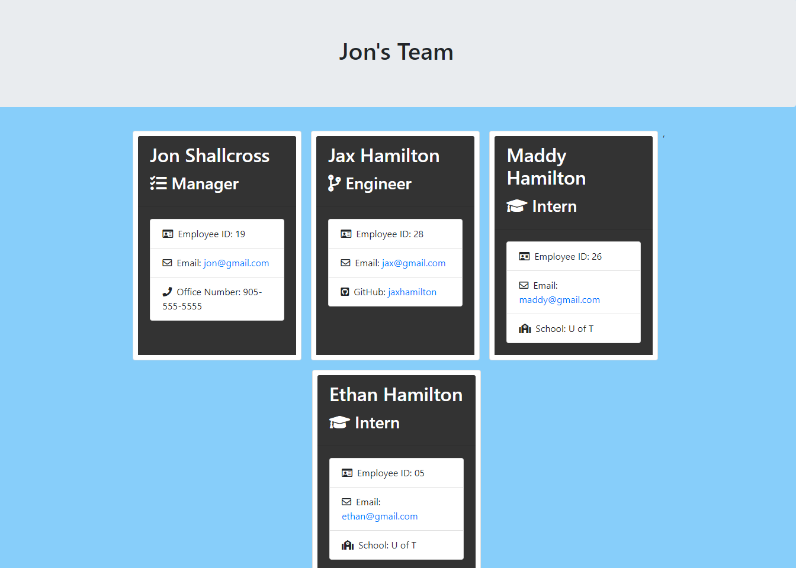

# Team-Profile-Generator

## Grading Requirements
---
YouTube Video Link: (https://youtu.be/ZGmfErWGRjE)  

Below is a screenshot of the completed HTML file.   
There is also a copy in the dist folder in the repository.

## Description
---   
User input is turned into a team profile website. All fields are required to be entered. Additionally the email must be a valid form.

## Installation
---  
Install node. Run by typing index.js in the terminal.   

## Testing
--- 
All tests passing video.
You Tube Link: (https://youtu.be/1ZNt5KhaTtw)

## Usage
---  
Easily create a profile of your work team to access their information. Created file found in the dist folder under the name team.html.

## Contributions
---
Stack overflow helped sort out the RegExp email validator.